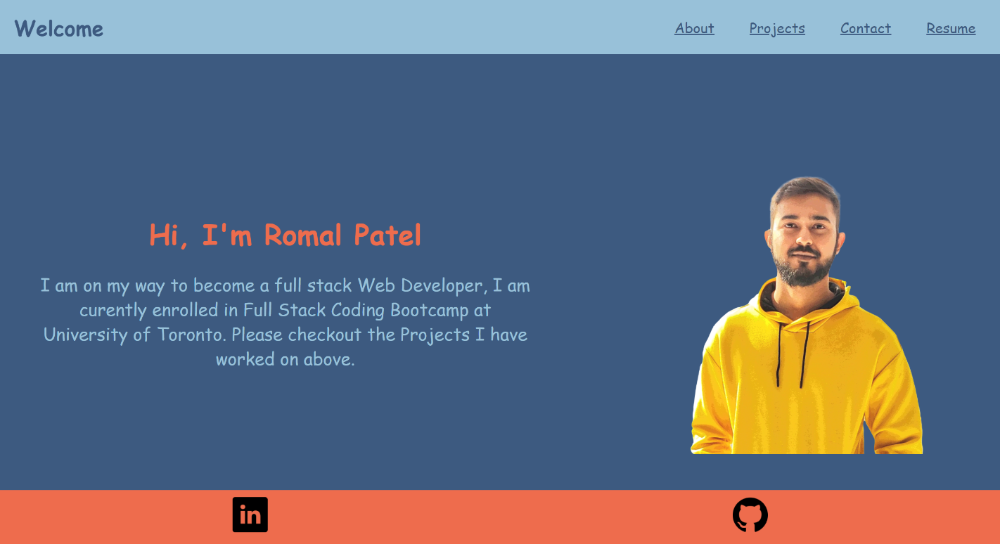
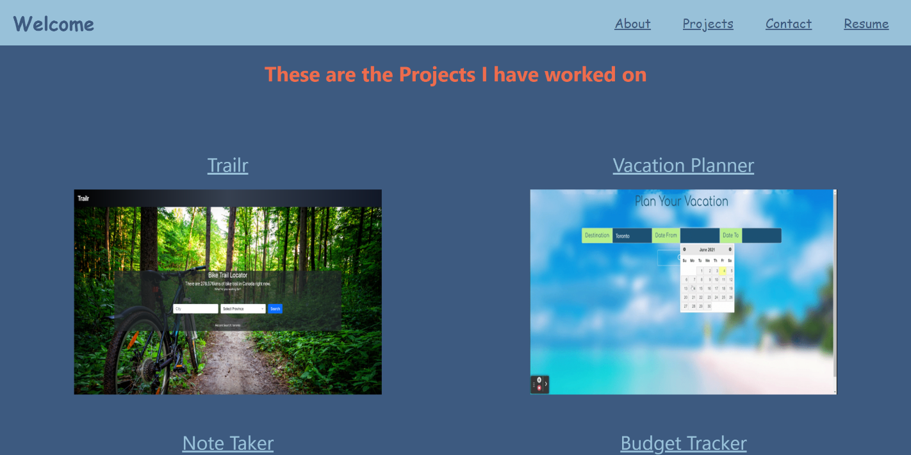
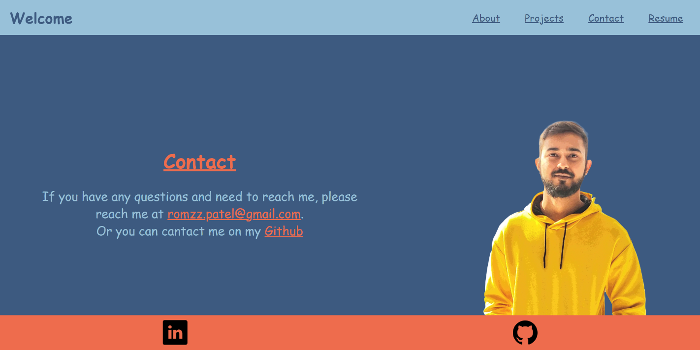

# React-Portfolio

## Description

This Portfolio was built with the help of React.js and is deployed with the help of Heroku.

## Table of Contents

- [Github Repository](#GithubRepository)
- [Link to the App](#App)
- [Screenshots](#Screenshots)
- [Questions](#Questions)

## Github Repository

The link to the demo can be found [Repository](https://github.com/romzzp/React-Portfolio).

## App

The link to the app can be found [App](https://react-romal.herokuapp.com/).

## Screenshots

Home page

Projects page

Contact page

## Questions

If you have any questions regarding the application you can reach me at [github](https://github.com/romzzp) or at my [email](romzz.patel@gmail.com).
